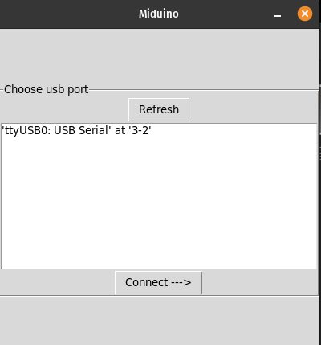
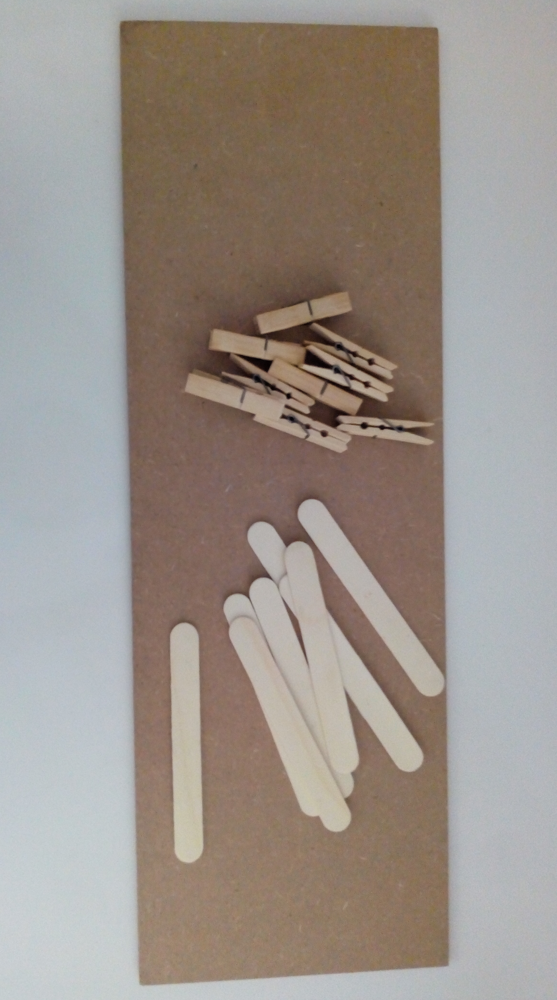
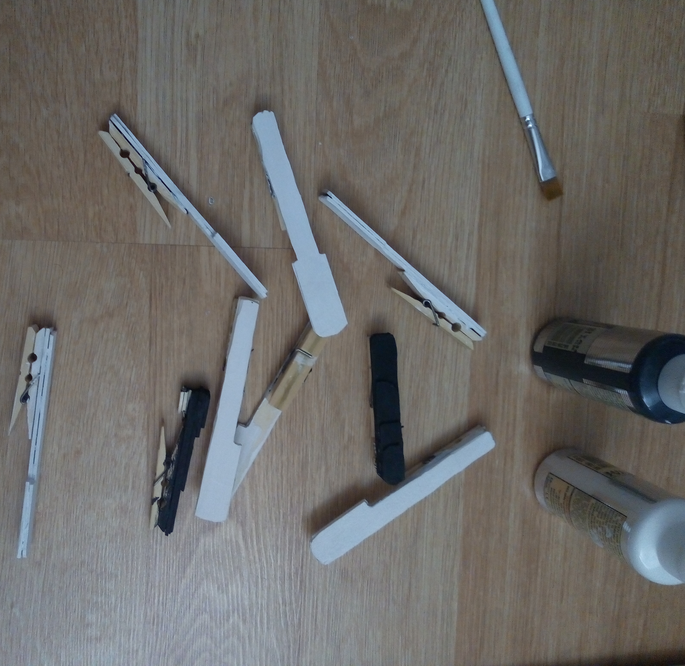
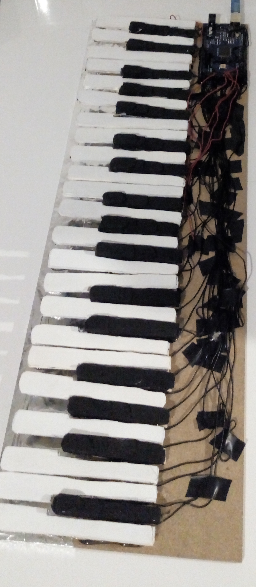

# Miduino
MIDI Keyboad using Arduino and Python

### Pc Program

### Physical Build

##### Mdf board, popsicle sticks, wooden clothespins

##### Painting and constructing the individual keys

##### All the keys and the arduino wired up on the mdf board

